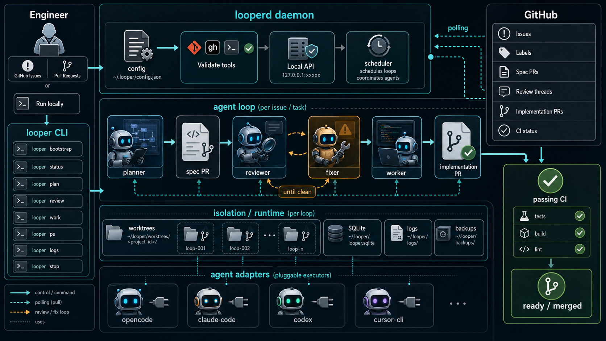

# Looper

[](https://github.com/powerformer/looper/actions/workflows/ci.yml)
[](LICENSE)
[](go.mod)

**Run an autonomous AI dev team across all your GitHub repos — plan, review, fix, and ship, on a loop.**

Register every repo you own. Looper watches them all, picks up labeled issues, and runs specialized AI agents — **planner → reviewer ↔ fixer → worker** — until the work is shipped. You stay in GitHub; Looper handles the spec, review cycle, and implementation in isolated worktrees.



# Features

- 🚢 **Ship from an issue, not a prompt.** Label `looper:plan`, assign it, and a spec PR shows up. Approve it, and implementation begins.
- 🛰️ **Every repo, one daemon.** Register all your projects once — Looper watches them together and runs loops across repos in parallel.
- 🔁 **Review loops that converge.** Reviewer and fixer ping-pong on a PR until threads are resolved and the review is clean — no babysitting.
- 🌳 **Parallel-safe by design.** Every loop runs in its own git worktree, so agents can work across issues and repos without stepping on each other.
- 🤖 **Bring your own agent.** Pluggable vendor layer (`opencode`, `claude-code`, `codex`, `cursor-cli`) so you're not locked into one model or CLI.
- 🧰 **Local, inspectable, killable.** A Go daemon (`looperd`) on your machine, a thin CLI (`looper`) to drive it. `looper ps`, `looper logs`, `looper stop` — it's just processes.

This repo ships two binaries:

- `cmd/looperd` — the background daemon that runs loops, polls GitHub, and manages worktrees
- `cmd/looper` — the CLI you actually talk to

## How it works

```
GitHub issue  ──►  planner  ──►  spec PR
                                   │
                                   ▼
                    ┌──────  reviewer  ◄─────┐
                    │                        │
                    ▼                        │
              review clean?  ── no ──►  fixer
                    │
                   yes
                    │
                    ▼
                 worker  ──►  implementation PR  ──►  🎉
```

Each role is an agent run in its own worktree, coordinated by `looperd` and gated by GitHub labels. The planner opens a spec PR, reviewer and fixer loop until the spec is clean, and `looper:spec-ready` hands the approved spec to the worker for implementation.

Looper is poll-driven, not webhook-driven: keep `looperd` running and `gh` authenticated for the loop to fire. Everything runs locally — no hosted control plane required.

## Install

One-liner (macOS, `darwin-arm64`):

```bash
curl -fsSL https://raw.githubusercontent.com/powerformer/looper/main/scripts/install.sh | sh
looper bootstrap --yes --project-path /path/to/repo --agent-vendor opencode
```

`bootstrap` writes your config, installs the managed daemon, registers the project, and starts `looperd`.

Full install, upgrade, uninstall, and from-source instructions: **[docs/installation.md](docs/installation.md)**.

## Quick start

Once `looper status` and `gh auth status` both look healthy:

```bash
# plan a spec from an issue
looper plan --project myproj --issue 123

# review a PR (one-shot, or keep looping as new commits land)
looper review owner/repo#42
looper review owner/repo#42 --loop

# implement from an issue (reuses planner's spec PR if one exists)
looper work --issue 123
```

Inside a registered repo, `--project` is usually optional for `review` and `work`. Pass it explicitly from outside the repo or when multiple projects could match.

The full workflow — label conventions, assignment rules, how planner / reviewer / fixer / worker hand off — is in **[docs/users-guide.md](docs/users-guide.md)**.

## Command cheatsheet

**Setup & health**

```bash
looper bootstrap            # first-run setup
looper status               # daemon + config health
looper version
looper project list|add
```

**Run the loop**

```bash
looper plan   --project <id> --issue <num>
looper review <pr> [--loop]
looper work   --issue <num>
looper loop start --type fixer --pr <repo>#<pr>
```

**Inspect PRs**

```bash
looper pr list
looper pr show   <repo>#<pr>
looper pr status <repo>#<pr>
```

**Manage running loops**

```bash
looper ps                   # list active loops
looper logs <id> --follow   # stream logs
looper jump <id>            # jump into a loop's worktree
looper stop <id>
```

**Daemon control**

```bash
looper daemon install|start|stop|restart|status
```

## Configuration

- Default config: `~/.looper/config.json`
- Precedence: defaults → config file → environment → CLI flags
- `agent.vendor` is required to run loops (no default)
- If `server.authMode=local-token`, the CLI reads `LOOPER_TOKEN`

Every field, env var, CLI flag, validation rule, and troubleshooting note lives in **[docs/configuration.md](docs/configuration.md)**.

## Development

From the repo root:

```bash
go run ./cmd/looperd
go run ./cmd/looper <args>
go build ./...
go vet   ./...
go test  ./...
```

Build artifacts go to `dist/` and are gitignored — don't edit generated files.

## Runtime notes

- `looperd` fails fast on invalid config; runtime paths must be writable
- Managed daemon installs live at `~/.looper/bin/looperd`
- Daemon-managed worktrees live under `~/.looper/worktrees/<project-id>/`
- When `notifications.osascript.enabled=true`, `osascript` must resolve on startup
- Automation is poll-driven, not webhook-driven — keep `looperd` and `gh` running for the loop to fire
